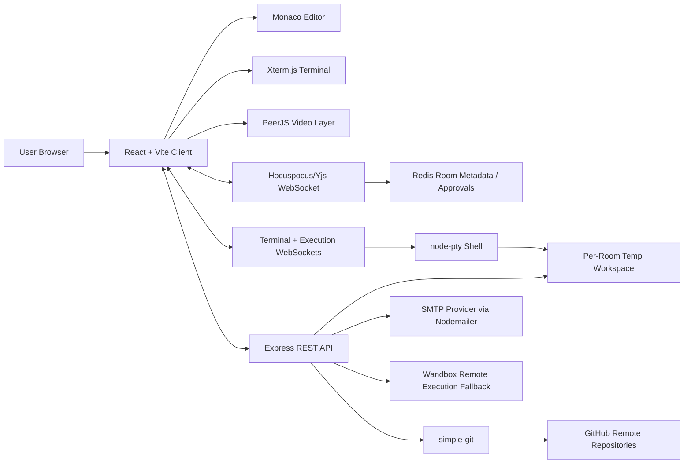
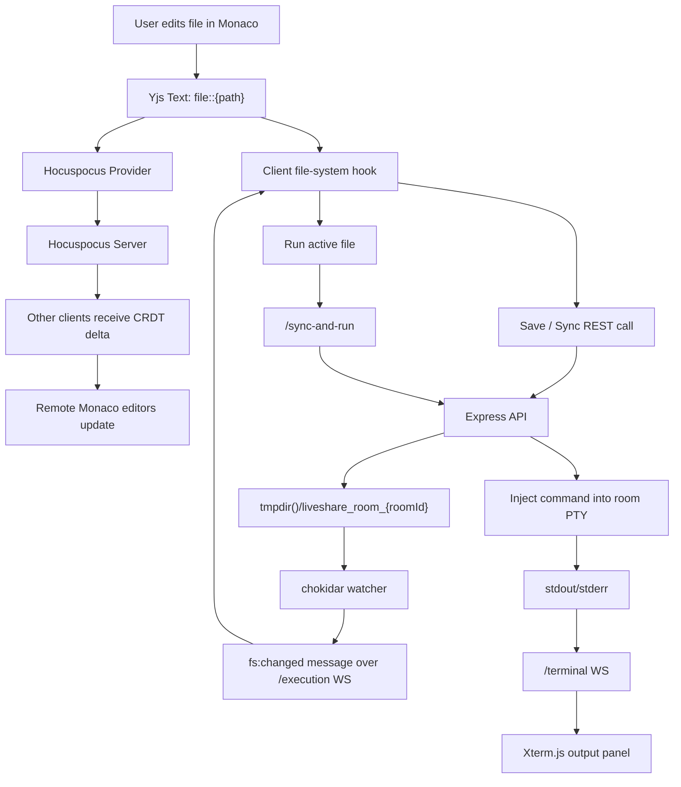
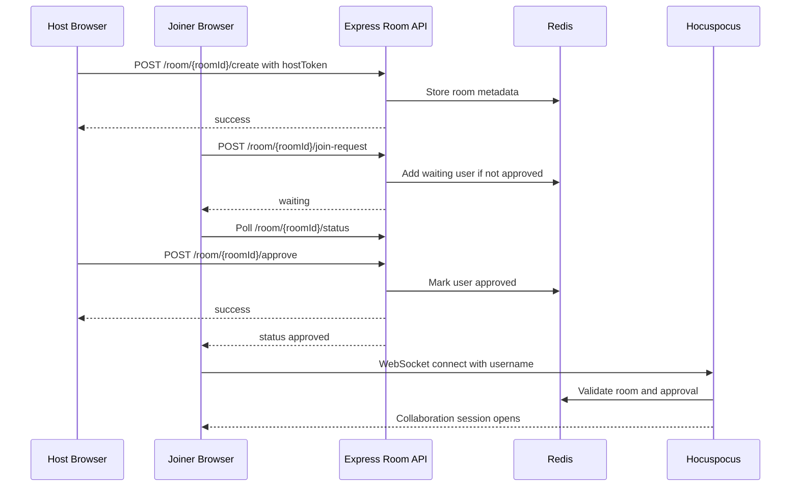
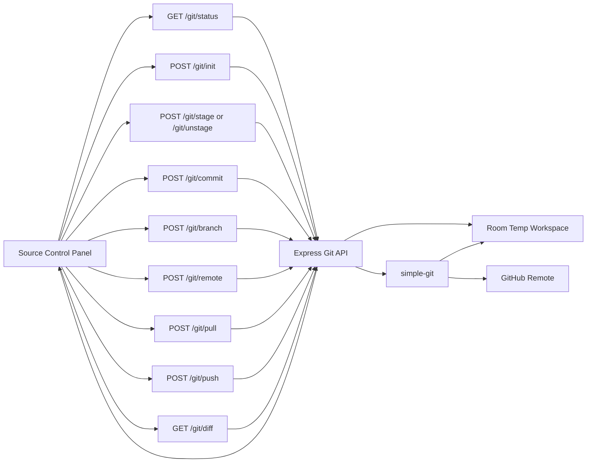

# CodeTogether / LiveShare Project Overview

**Prepared from:** `.planning/` project notes and current client/server code  
**Date:** 2026-05-05  
**Product type:** Real-time collaborative coding IDE, compiler, terminal, and source-control workspace

## Executive Summary

CodeTogether, also referenced in planning as LiveShare, is a browser-based collaborative development environment for real-time coding sessions. It combines shared code editing, room-based access control, integrated execution, a multi-file IDE workspace, terminal streaming, GitHub-backed source control, chat, video presence, and email invitations into one shared session model.

The application is built as a unified client-server system. The frontend is a React/Vite application that renders the landing flow, compiler room, and full IDE room. The backend is a Node.js/Express server that also hosts Hocuspocus/Yjs WebSocket collaboration, terminal WebSockets, execution endpoints, room access APIs, file-system APIs, Git operations, and invitation email delivery.

The strongest architectural theme is **ephemeral collaboration**. Active rooms are tracked in Redis and memory, live document state is synchronized through Yjs CRDTs, and workspace files are written into temporary per-room directories only when needed for terminal, execution, file import, or Git workflows. Planning documents describe this as a "Zero-Data Sanctuary" policy: rooms are temporary, and empty room state is cleaned after a short delay.

## Current Planning Status

The planning folder shows the project is in the `v1.0` execution milestone.

| Area | Status | Notes |
|---|---:|---|
| Domain migration | Done | `code-together.me` is established as the primary frontend domain. |
| URL and CORS cleanup | Done | `FRONTEND_URL` is the unified allowed-origin variable. |
| Production cleanup | Done | Test scripts and temporary diagnostics were removed from the plan. |
| Email invitation system | In progress | Nodemailer-based implementation exists; production SMTP credentials are still the blocker. |
| Git reliability refinement | Pending / partially addressed | Planning notes target push/pull reliability, fresh repo behavior, branch sync, and clearer errors. |
| Backlog | Pending | Cursor presence enhancements, multi-file search, and admin room dashboard. |

## Technology Stack

### Frontend

- **React 18.2** for the browser UI.
- **Vite 8 beta** for build and development tooling.
- **Monaco Editor** through `@monaco-editor/react`, `monaco-editor`, `y-monaco`, and Codingame Monaco VS Code packages.
- **Yjs** for CRDT-backed shared text and room state.
- **Hocuspocus Provider** for collaboration WebSocket connectivity.
- **IndexedDB persistence** through `y-indexeddb` for client-side room document caching.
- **Xterm.js** with fit and web-links addons for browser terminal rendering.
- **Framer Motion** for motion and modal polish.
- **Lucide React** for UI icons.
- **PeerJS** for video-call peer identity and media connection support.
- **React Diff Viewer** for Git diff viewing.
- **TailwindCSS 4.2** is present, with most current UI styling implemented inline or in CSS modules.

### Backend

- **Node.js** runtime.
- **Express 5.2** for REST APIs.
- **Hocuspocus Server** for Yjs synchronization and room authentication.
- **ws** for terminal and execution WebSocket channels.
- **node-pty** for per-room interactive shell sessions.
- **chokidar** for server-side file-system watching and change broadcasts.
- **simple-git** for repository initialization, status, staging, commit, branch, pull, and push flows.
- **Nodemailer** for SMTP-backed room invitations.
- **Redis / Upstash Redis / y-redis** for room metadata, waiting lists, approvals, denials, and active-room state.
- **axios** for external API calls, including GitHub API access and execution fallback services.
- **express-rate-limit** for API abuse protection.

### Deployment Configuration

- Production frontend: `https://code-together.me`
- Production backend/API/collaboration default: `https://code-together-collaborative-ide.onrender.com`
- Important environment variables:
  - `FRONTEND_URL`
  - `PORT`
  - `REDIS_URL` or Upstash Redis configuration
  - `SMTP_HOST`, `SMTP_PORT`, `SMTP_USER`, `SMTP_PASS`, optional `SMTP_SECURE`, `SMTP_FROM`
  - Client-side `VITE_WS_URL`, `VITE_API_URL`, `VITE_COLLAB_URL`

## Feature Overview

### Room Lifecycle and Access Control

Users begin from the landing page by creating or joining a room. Room creation stores a host token in the browser and registers room metadata on the backend. Joiners submit a room access request and may wait for host approval before the Hocuspocus collaboration socket authenticates. Supported room types include:

- **Collaborative:** participants can edit and run code.
- **Interview:** structured mode where the host has moderation controls and an interview timer can be shared.
- **Broadcast:** designed as a safer read-only teaching mode.

Hosts can approve, deny, kick, limit, or destroy rooms through backend room APIs. Room metadata and waiting/approved/denied lists are managed through Redis service helpers.

### Real-Time Collaborative IDE

The IDE mode centers on `useIDERoom.js`, which creates a Yjs document, connects it to Hocuspocus, publishes awareness state, and manages editor, chat, room settings, permissions, active users, terminal state, Git state, and file selection. Each file maps to a Yjs text object using the key pattern `file::{path}`. Monaco is bound to the active Yjs text with `MonacoBinding`, allowing multiple clients to edit the same file without central locking.

The client also tracks room-level Yjs state in a shared map, including room type, room mode, host identity, room theme, room font, chat settings, visible users, kicked users, restricted users, and interview start time.

### File Workspace and Terminal

The file-system hook manages directory trees, file content, imports, creates, renames, deletes, and sync-to-disk operations. The server stores files in a room-specific temp directory:

```text
tmpdir()/liveshare_room_{roomId}
```

When files change on disk, `chokidar` emits debounced `fs:changed` messages over the execution WebSocket so clients can refresh the relevant folder. The terminal panel connects over `/terminal?roomId=...&terminalId=...`, and the backend spawns one `node-pty` shell per room/terminal pair. Output is streamed back to all matching clients and a short terminal history is retained for reconnects.

### Code Execution

There are two execution styles:

- **Compiler mode:** sends language and code to `/run`, where the backend executes queued jobs and broadcasts output.
- **Full IDE mode:** sends all files and active-file metadata to `/sync-and-run`; the server writes files into the room directory and injects the run command into the active room terminal.

Execution is serialized per room through a queue to avoid overlapping runs in the same workspace. The planning notes also call out a remote execution fallback service through `server/services/wandbox.js`.

### GitHub Source Control

The source-control panel and settings panel call the backend Git API to support:

- repository initialization
- Git status polling
- stage and unstage
- commit
- remote configuration
- GitHub repository listing from a personal access token
- push and pull with token handling
- branch creation, rename, and switch
- diff viewing

Planning highlights Git push/pull reliability as an important upcoming production-hardening track, especially for fresh repositories and clearer user-facing errors.

### Communication and Collaboration UX

The product includes room chat, private chat targets, active-user presence, active-file visibility, room-wide theme/font controls, participant restriction, kicking, invite links, and a PeerJS-powered video-call component. The email invite system is implemented around a Nodemailer service and a `POST /api/rooms/:roomId/invite` endpoint, with production delivery awaiting SMTP credentials.

## System Context Diagram



## Primary Data Flow Diagram



## Room Join and Approval Sequence



## Git Workflow Data Flow



## Strengths

- **Clear real-time architecture:** Yjs/Hocuspocus is a strong fit for concurrent editing and presence.
- **Unified backend:** one server hosts room APIs, collaboration upgrades, execution WebSockets, terminal WebSockets, file APIs, Git APIs, and invitation APIs.
- **Feature depth:** the project goes beyond a shared editor by including terminal, Git, file import, chat, video, access control, and email invites.
- **Ephemeral workspace model:** temp room folders and cleanup timers align with the privacy-first product promise.
- **Room-specific execution queue:** per-room serialization reduces execution conflicts when multiple users run code.

## Risks and Hardening Priorities

- **Command execution security:** dynamic command construction and PTY access require strict path and argument handling.
- **Temp file isolation:** room workspaces should enforce path boundaries, size limits, and cleanup guarantees.
- **Git credential handling:** GitHub PAT usage should be carefully scoped, never logged, and ideally stored only client-side or short-lived server-side.
- **Automated testing gap:** planning notes say there is no formal test framework. This is the largest reliability risk for Git, room approvals, filesystem sync, and execution.
- **Vite beta dependency:** Vite 8 beta may create production build or ecosystem instability.
- **Large workspace pressure:** Yjs documents, terminal sessions, file imports, and Redis state can grow with room count and workspace size.

## Recommended Next Steps

1. **Finish SMTP production setup:** configure provider credentials in Render, verify invite delivery, and test invite-link autofill.
2. **Stabilize Git push/pull:** add targeted integration tests for fresh repos, empty remotes, branch rename/switch, auth failure, and merge conflicts.
3. **Add minimal automated tests:** start with backend route tests for room approval, filesystem boundary checks, Git status/init, and invite endpoint failure modes.
4. **Harden execution:** centralize run-command generation, quote arguments safely, and add workspace size/time/process limits.
5. **Improve observability:** structured logs for room lifecycle, execution queue, terminal spawn/exit, Git operations, and email delivery.
6. **Document environment setup:** create a production `.env.example` and deployment checklist for frontend, backend, Redis, SMTP, and allowed origins.

## One-Line Positioning

CodeTogether is a real-time, privacy-conscious collaborative IDE that blends CRDT editing, temporary shared workspaces, terminal-backed execution, GitHub source control, room moderation, and invitation workflows into a production-oriented browser development environment.
